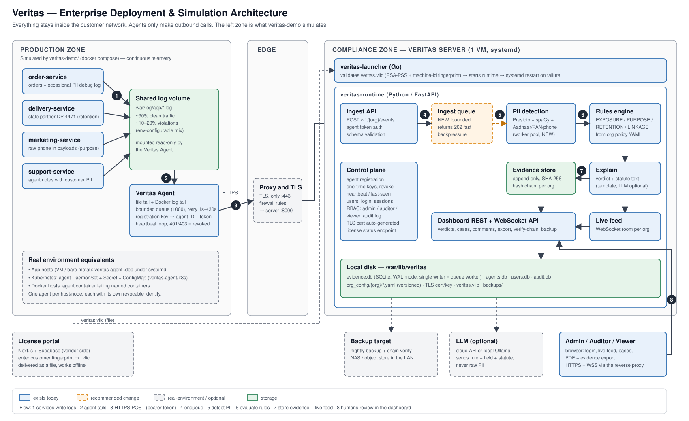

# Veritas: Project Overview

Veritas is an on-premise compliance monitoring platform for India's Digital Personal Data Protection Act (DPDPA) 2023. It watches an organisation's application logs and API traffic, finds personal data being handled improperly, records tamper-evident evidence, and gives compliance staff a live dashboard to investigate and resolve each case. Everything runs inside the customer's network.

**Contents**
1. [Project status](#1-project-status)
2. [Architecture](#2-architecture)
3. [Implementation](#3-implementation)
4. [How it works](#4-how-it-works)
5. [Example: deploying in a real company](#5-example-deploying-in-a-real-company)

Related documents: `docs/ENTERPRISE_TELEMETRY_SPEC.md` (the intended enterprise agent and telemetry model), `IMPLEMENTATION_ORDER.md` (roadmap and backlog), `LINUX_TEST_FINDINGS.md`, `LICENSE_PORTAL_REVIEW.md`, `veritas-demo/SIMULATION_PLAN.md`, `INSTALL.md` (install steps).

---

## 1. Project status

Last updated: 2026-10-05. Latest release: **v1.0.16**.

### What is built and verified

| Area | State | Evidence |
|---|---|---|
| Detection (PII in logs/API payloads) | Working | Presidio + spaCy with custom Aadhaar, PAN and Indian phone recognizers |
| Rule engine | Working | Four rules: EXPOSURE_001, PURPOSE_001, RETENTION_001, LINKAGE_001 |
| Evidence store | Working | Append-only SQLite, SHA-256 hash chain per organisation, chain verification |
| Dashboard | Working | Overview, Live Stream, Audit Ledger, Agents, Policy, Audit Log, Scan Sandbox |
| Authentication and roles | Working | Local accounts; roles SUPER_ADMIN, COMPLIANCE_ADMIN, AUDITOR, VIEWER; RBAC tests |
| Agent registration | Working | One-time registration keys, per-agent token, heartbeat, revoke |
| Agent (log forwarder) | Working | File and Docker log tailing, retry and bounded buffer; Docker, Kubernetes DaemonSet and `.deb` forms |
| Licensing | Working | RSA-PSS signed `.vlic`, machine-bound option; portal signing verified against the Python and Go verifiers |
| Multi-organisation | Working, org-agnostic | No customer-specific code or bundled configs; each org uploads its own config |
| Linux package | Released and tested | `.deb` installs and runs on a clean Ubuntu 22.04 runner in CI |
| macOS and Windows installers | Released and tested in CI | `.pkg` and installer pass their install tests |
| Automated tests | 412 passing, 1 skipped | Run on Ubuntu, macOS and Windows in CI |

### Done in the current cycle
- Removed all customer-specific code and bundled sample configs; the product is org-agnostic. Fixed a retention bug (retention is now measured from an optional per-field `data_since`, defaulting to when the org config was uploaded).
- Linux fingerprint v2 (machine-id based). The CLI and the running service now compute the same value; the old method could differ between them.
- A missing or invalid license now stops the service once with a clear message instead of crash-looping.
- Added a Linux install test to CI (build, install, license cases, restart, crash recovery, uninstall).
- Released v1.0.16.

### In progress / not yet done
| Item | Status |
|---|---|
| Test on real Ubuntu hardware | Next: a tester with an Ubuntu machine installs v1.0.16 using a license issued for their fingerprint |
| Simulated enterprise environment | Planned (`veritas-demo/SIMULATION_PLAN.md`); a teammate will build it |
| Ingest queue and worker pool | Planned. Detection currently runs inside the `/events` request, so heavy bursts from many agents are not yet proven |
| License portal fixes | Planned: fingerprint validation, row-level security on its database, save-failure reporting; needs a new Supabase project |
| macOS and Windows fingerprint | Still the older scheme; to be moved to the same machine-id style scheme |
| Offline hardening | Planned: bundle fonts and the PDF library locally |
| Support email, CI signing key, other items | Listed in the backlog in `IMPLEMENTATION_ORDER.md` |

### Known limitations
- One server process and SQLite: suitable for a pilot and mid-sized deployments, not for horizontal scale.
- License "revocation" is not enforceable (licenses are files verified offline and expire by date).
- Performance at about 100 events per second is untested.

---

## 2. Architecture



*Diagram key: blue boxes exist today, orange dashed boxes are recommended changes (the ingest queue and worker pool), grey dashed boxes are real-environment or optional parts. The left zone is what the simulation stands in for.*

### Components

| Component | What it does | Runs on |
|---|---|---|
| **Veritas Agent** | Tails log files and Docker container logs, forwards each line to the server with a per-agent token, buffers and retries when the server is unreachable | Every application host or node |
| **Reverse proxy** | Terminates TLS and exposes only port 443 | Customer edge |
| **Veritas Server (runtime)** | Receives events, detects PII, evaluates rules, stores evidence, serves the dashboard and API | One VM or server |
| **Launcher / service wrapper** | Starts the runtime under the OS service manager (systemd on Linux) | Same machine |
| **Evidence store** | Append-only, hash-chained record of every verdict, per organisation | Server disk |
| **Org config (YAML)** | The organisation's data inventory and policy: fields, purposes, consent scopes, retention, linkage rules | Server disk, versioned |
| **Dashboard** | Live feed, audit ledger, case handling, agent management, policy view, PDF/evidence export | Browser |
| **License portal** | Vendor-side web app that signs `.vlic` license files | Vendor (Vercel + Supabase) |
| **LLM (optional)** | Natural-language investigation of a violation; receives rule, field name and statute text, never raw PII. Supports cloud APIs or a local model (Ollama-compatible) | Cloud or local |

### Key design choices
- **Everything stays inside the customer network.** Agents only make outbound calls to the server. The only optional egress is the LLM call, and a local model removes even that.
- **Config-driven, no customer logic in code.** Each organisation uploads a YAML describing its fields and policy. The same code serves every organisation.
- **Tamper-evident evidence.** Each verdict stores a hash of itself and the previous one; the dashboard can verify the whole chain.
- **Strict tenant separation.** The organisation id comes from the URL path and the user's permissions, never from the browser state, and each org has its own evidence chain.
- **Offline-first licensing.** A license is a signed file checked locally. No call home is needed.

---

## 3. Implementation

### Technology
| Layer | Choice |
|---|---|
| Server | Python 3.11, FastAPI, uvicorn, Pydantic v2 |
| PII detection | Microsoft Presidio, spaCy `en_core_web_lg`, custom recognizers (Aadhaar, PAN, Indian phone) with validators |
| Storage | SQLite (evidence, agents, users, audit log), YAML (org configs) |
| Frontend | Single-page vanilla HTML/CSS/JS served by the server (no build step) |
| Agent | Python (Docker image, `.deb`, Kubernetes manifests) |
| Packaging | PyInstaller binary; `.deb` (Linux), `.pkg` (macOS), Inno Setup installer (Windows); Go launcher for service management |
| Licensing | RSA-2048, RSA-PSS SHA-256, base64 payload; Go and Python verifiers |
| License portal | Next.js 14, Supabase (PostgreSQL), hosted on Vercel |
| CI | GitHub Actions: cross-platform tests, per-OS install tests, tagged release builds |

### Repository layout
```
dpdpa-agent/            core server
  run_pipeline.py       entry point (--fingerprint, --check, --port)
  dashboard/            FastAPI app, WebSocket live feed, HTML pages
  api/                  event ingestion, agents, auth, RBAC dependencies
  detection/            PII detection engine and custom recognizers
  rules/                rule engine (exposure, purpose, retention, linkage)
  evidence_store/       hash-chained, append-only store
  org_config/           org config schema, validator, versioned store
  registry/             builds per-field policy entries from the org config
  user_store/           accounts and roles
  llm_explainer/        templated and optional LLM explanations
  license.py            license validation and machine fingerprint
  tests/fixtures/       sample org configs used only by the tests
veritas-agent/          log forwarder (Dockerfile, k8s manifests, .deb scripts)
veritas-launcher/       Go service wrapper and license check
veritas-license-portal/ vendor license portal (git submodule)
veritas-demo/           demo services and the simulation plan
package/                .deb and .pkg packaging
installer/              Windows installer script
tools/                  license generation and fingerprint tools
.github/workflows/      CI, release, per-OS install tests
```

### Data model (essentials)
- **Event:** organisation, source system, timestamp, raw text snippet, optional structured fields.
- **Verdict:** organisation, rule id, severity (LOW/MEDIUM/HIGH), the field and source involved, an explanation, a breach-notification flag, status (OPEN, ACKNOWLEDGED, RESOLVED; the only mutable part), the previous verdict's hash and its own hash.
- **Org config:** identifiers, fields (name, category, declared purpose, consent scope, retention days, source system, optional `data_since`) and linkage rules.

### Security
- Passwords hashed with bcrypt; signed session tokens; login, setup and agent-registration endpoints are rate-limited.
- Agents authenticate with a revocable bearer token issued from a one-time registration key.
- TLS is automatic (self-signed by default, or supply your own certificate); sensitive evidence payloads are encrypted with a locally generated key.
- Role checks are enforced on the server side (covered by the RBAC tests); the browser cannot grant itself access by changing the organisation or role it sends.
- PII is masked in API responses and filtered from the server's own logs.

### Licensing
The vendor signs `{org, tier, issued, expiry, optional fingerprint}` with a private key that never leaves the vendor. The product embeds only the public key. On Linux the fingerprint is `v2:` plus a hash of the machine's `/etc/machine-id` (disk serial as fallback), so it does not change when the server is renamed or its network changes. A machine-bound license only runs on the machine it was issued for.

---

## 4. How it works

### The path of one event
1. An application writes a log line, for example a debug message that dumps a customer record.
2. The **agent** reads the new line and sends it to `POST /v1/{org}/events` with its token.
3. The server checks the token, then **detects PII** in the text and in any structured fields (names, Aadhaar, PAN, phone, email), with validators to cut false matches.
4. The **rule engine** compares what was found with the organisation's declared policy:

| Rule | Fires when |
|---|---|
| EXPOSURE_001 | Raw personal data appears where it should never appear, such as logs or API responses |
| PURPOSE_001 | Data appears in a system whose declared purpose or consent scope does not allow it, or a field that is not declared at all |
| RETENTION_001 | Data in a source system is older than the retention days declared for that field |
| LINKAGE_001 | Several individually harmless fields appear together and could identify a person |

5. Each finding becomes a **verdict** with severity and an explanation (statute reference included). It is appended to the **evidence chain** and pushed to connected browsers over a WebSocket.
6. A compliance user sees it in the **Live Stream**, opens the case, asks the investigation panel questions, comments, and moves it from OPEN to ACKNOWLEDGED to RESOLVED. Reports and evidence can be exported, and the hash chain can be verified at any time.

### An illustrative example
*(Illustrative values, not real data.)*

A log line from an order service:
```
[2026-10-05T09:14:02Z] DEBUG order-service: fetched customer record {name: "Rohan Verma", phone: "9876543210", address: "Flat 4B, Green Meadows, Pune"}
```
Veritas detects a name and a phone number in a log, which the org's policy says must never be logged. It records an EXPOSURE_001 verdict with severity HIGH, masks the values in the dashboard (`[PHONE_REDACTED]`), and links the verdict to the previous one in the chain.

### Onboarding an organisation
An administrator creates the org in the dashboard (or uploads YAML) describing what data each system holds:
```yaml
org_id: acme_retail
fields:
  - field_name: phone
    pii_category: phone
    declared_purpose: order_fulfillment
    consent_scope: order_fulfillment
    retention_days: 1095
    source_system: order-service
  - field_name: aadhaar
    pii_category: aadhaar
    declared_purpose: onboarding_kyc
    consent_scope: onboarding_kyc
    retention_days: 180
    source_system: partner-service
    data_since: 2025-12-24     # this system already holds data from this date
linkage_rules:
  - fields: [name, phone, delivery_address]
```
No code change or redeploy is needed. Updating the policy creates a new versioned file, so policy changes are themselves auditable.

---

## 5. Example: deploying in a real company

A worked scenario for a fictional company, **Acme Retail**, which runs an order service, a payments service and a support tool on 8 application servers plus a small Kubernetes cluster. Compliance has two analysts and a data protection officer.

### Before the project starts
- Acme provides one Ubuntu 22.04 VM (4 GB RAM or more, 20 GB disk) in its compliance network zone, and a DNS name such as `veritas.acme.internal`.
- IT opens only the reverse proxy port (443) to the app network and to the compliance team, and allows outbound calls from the app servers to the Veritas VM.
- Acme decides whether investigations may use a cloud LLM, a local model, or no LLM at all.

### Day 1: install the server
1. Install the package: `sudo apt install ./veritas_<version>_amd64.deb`. The installer prints the machine fingerprint.
2. Send that fingerprint to the vendor. The vendor issues a license in the portal and sends back `acme.vlic`.
3. `sudo veritas license acme.vlic`. The service starts after a minute and the dashboard is available.
4. Put the reverse proxy in front, or replace the self-signed certificate with one from Acme's internal CA.
5. Open `/setup`, enter the one-time setup code from `sudo veritas setup-code` (it proves you have access to the server), create the first administrator, then add users with roles: the DPO as COMPLIANCE_ADMIN, the analysts as AUDITOR, and management as VIEWER.

### Day 2: describe the data
The compliance team creates the organisation `acme_retail` and declares the fields each system holds: purpose, consent scope and retention. They set `data_since` for any system that already stores older data, so the retention clock starts correctly.

### Day 3: connect the applications
For each application host:
1. In the dashboard, **Agents → Issue Registration Key**.
2. Install the agent (`veritas-agent` package), set the server address and the key in `agent-config.yaml`, and list the log files to watch.
3. For Kubernetes, apply the DaemonSet, Secret and ConfigMap from `veritas-agent/k8s/`.

Each agent shows up as ACTIVE with a heartbeat. If a host is retired or compromised, **Revoke** stops it immediately.

### Week 1: tune and operate
- Run in observation mode: review the first violations, fix the applications that log personal data, and correct the org config where the policy was too strict or too loose.
- Schedule backups (the backup command and API exist) and periodic chain verification; point monitoring at `/health` and `/ready` and collect the service logs.
- The DPO exports the audit report when needed; the hash chain proves the records were not changed.

### Ongoing
- Updates arrive as a new package; the data directory and configs stay in place.
- Policy changes are made by uploading a new org config version.
- Licenses are renewed by issuing a new file before the expiry date.

### Recommended capacity for this scenario
About 8 agents sending a few events per second each is within what one server handles today. For larger or burstier traffic, the planned ingest queue and worker pool should be in place first; the simulated environment is being built to measure exactly this.
